# 🐾 Pawsitive Finance Tracker

<div align="center">
  
</div>

Welcome to **Pawsitive Finance Tracker**, a cute and friendly Flutter app designed to help you track your income and expenses with ease!

> **Note:** This is my very first Flutter app! 🎉 I built it to learn the framework and create something useful and fun.

## 📸 Screenshots

<div align="center">
  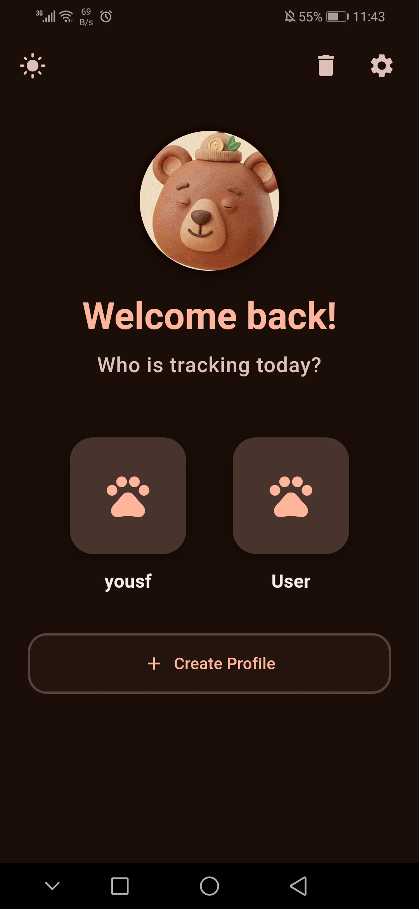
  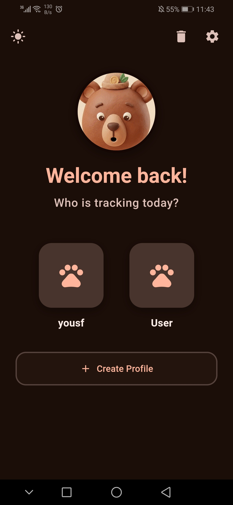
  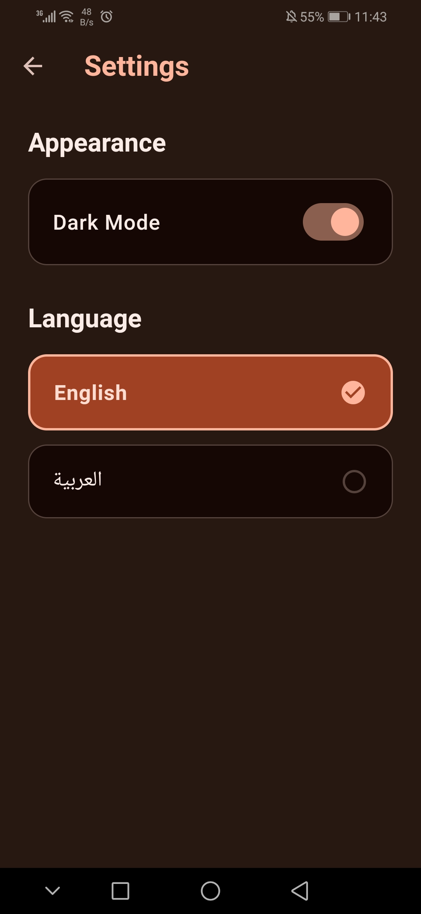
  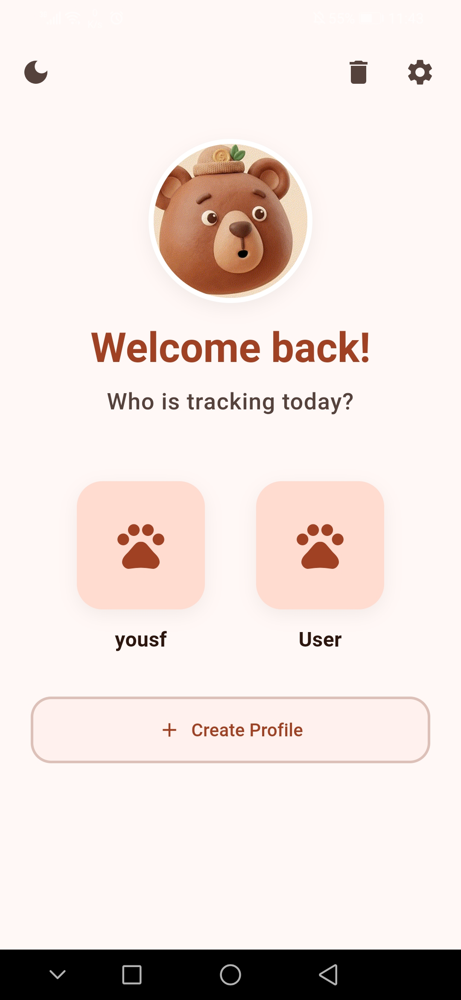
  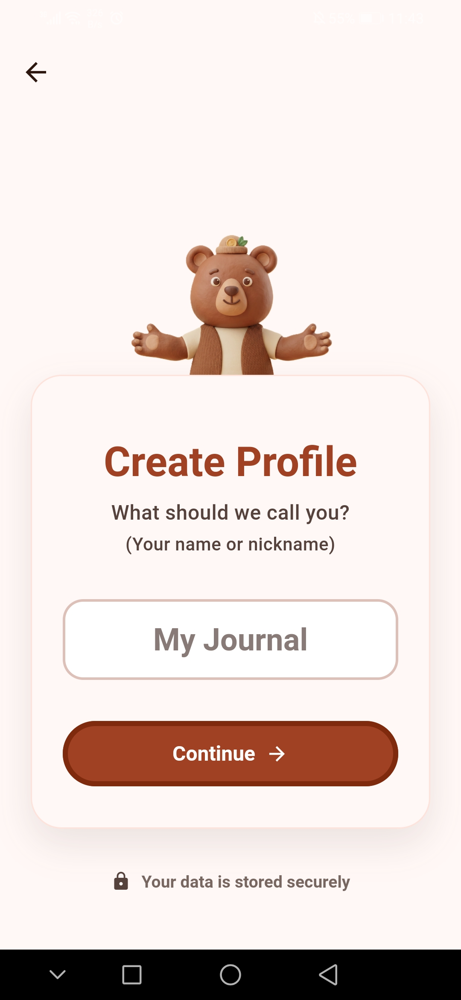
  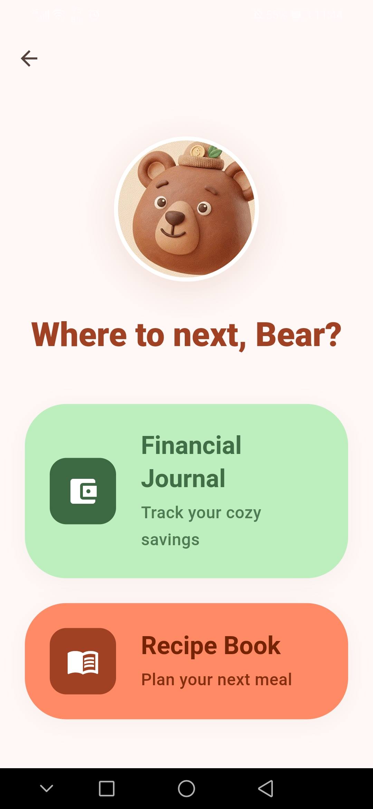
  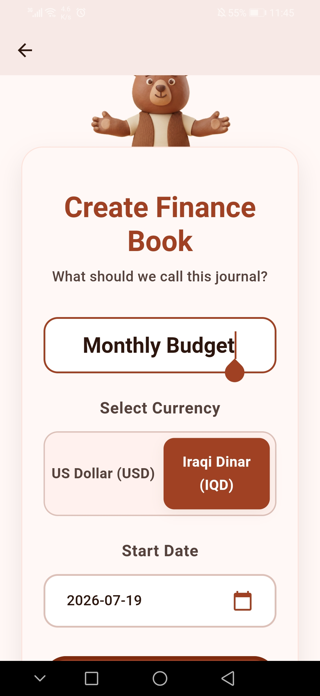
  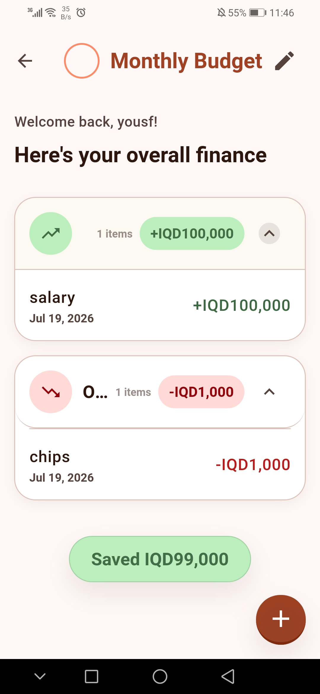
  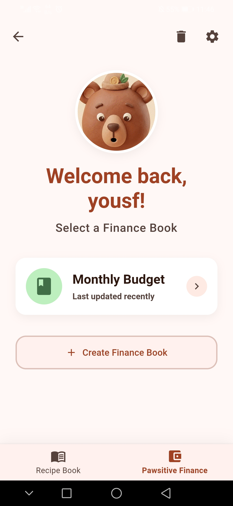
  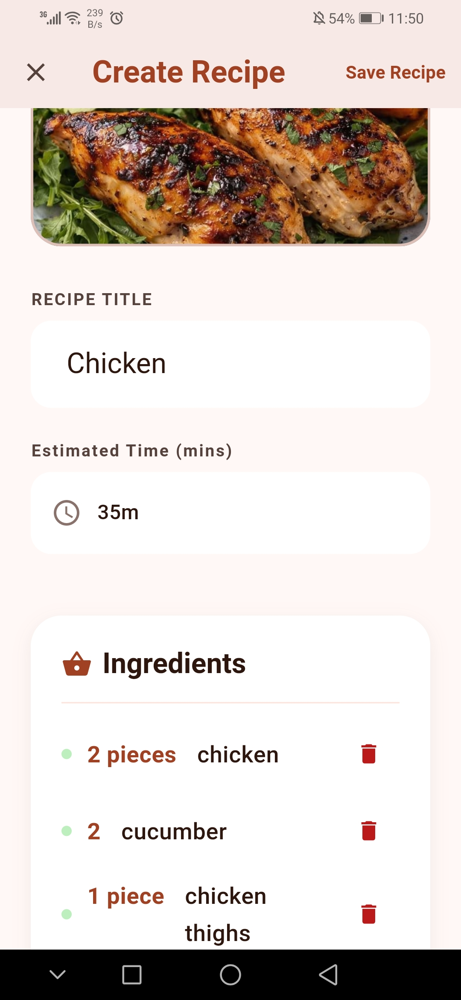
  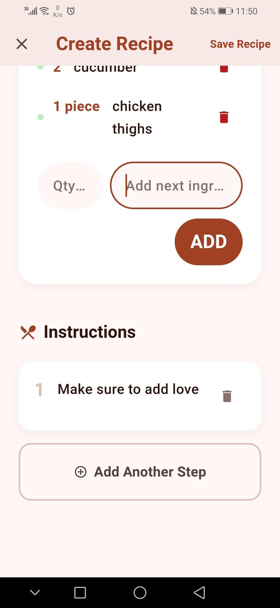
  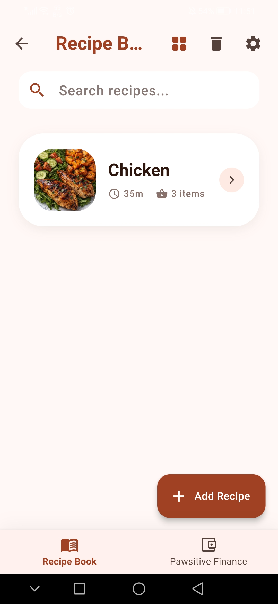
  
  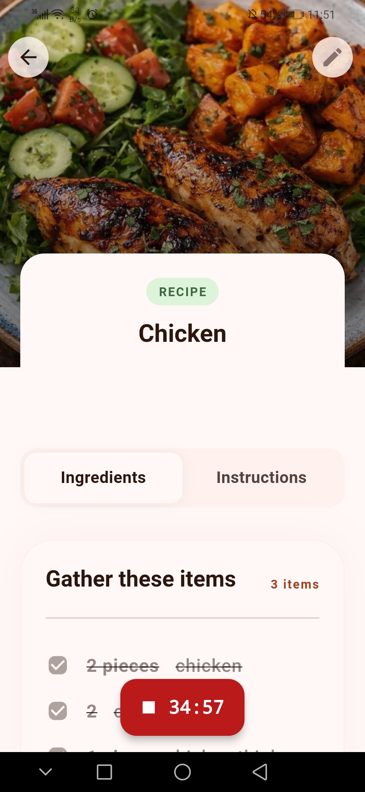
 
</div>

## 🌟 Features

- **Finance Tracking**: Log your daily incomes and outcomes seamlessly.
- **Recipe Book (v1.1+)**: Store and manage your favorite recipes in one place.
- **Multilingual Support**: Available in both **English** and **Arabic**.
- **Dark/Light Mode**: Easily toggle between themes in the settings.
- **Interactive Dashboard**: Get a quick overview of your financial status.

## 📦 Releases

This project has two distinct versions available in our [GitHub Releases](../../releases):

- **v1.0**: The core Finance Tracker experience without the recipe book.
- **v1.1**: Includes everything in v1.0, plus the new Recipe Book integration!

## 🚀 Getting Started

To get a local copy up and running, follow these simple steps:

### Prerequisites
- [Flutter SDK](https://docs.flutter.dev/get-started/install) installed on your machine.
- An IDE such as [VS Code](https://code.visualstudio.com/) or [Android Studio](https://developer.android.com/studio).

### Installation

1. Clone the repository:
   ```sh
   git clone https://github.com/YOUR_USERNAME/YOUR_REPO.git
   ```
2. Navigate to the project directory:
   ```sh
   cd YOUR_REPO
   ```
3. Install dependencies:
   ```sh
   flutter pub get
   ```
4. Run the app:
   ```sh
   flutter run
   ```

## 🛠️ Built With

- [Flutter](https://flutter.dev/)
- [Dart](https://dart.dev/)

---
*Stay pawsitive and keep your finances on track!* 🐶💰
